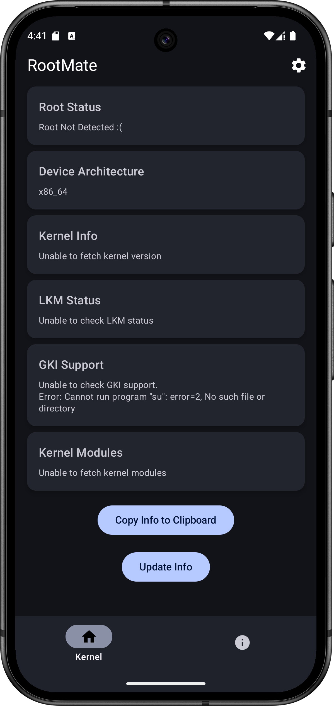
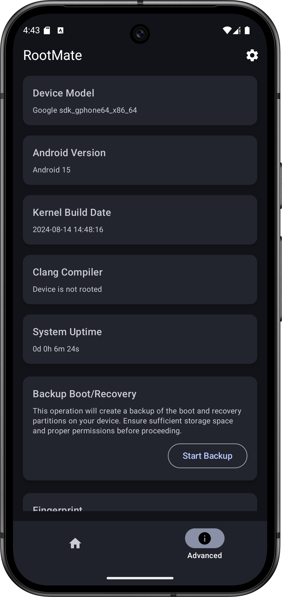
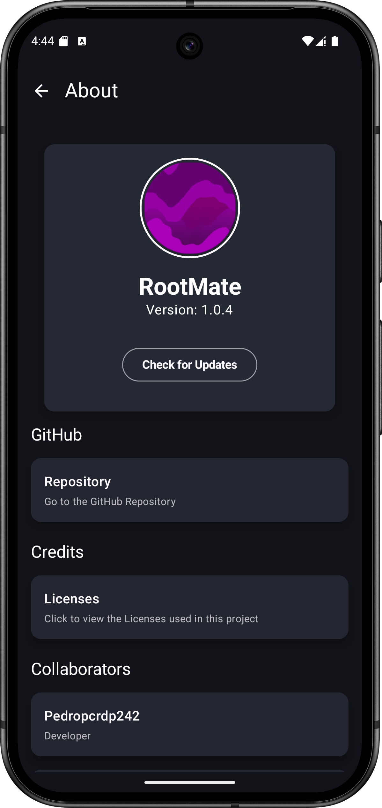

# RootMate!

## About

RootMate is an open-source application designed to retrieve detailed information about the Root Access and the type of root you're using. With this app, you can:

- Check if the device has root access.
- Identify the type of root (Magisk, KernelSU, or other).
- Retrieve detailed kernel information, such as version and architecture.
- List kernel-loaded modules (LKM).

More details are provided below.

## Features

### 1. Root Detection

- Check if your device has root access and identify the type of root being used.

### 2. Kernel Information

- Get detailed information about the kernel version and system architecture.

### 3. LKM Status

- Find out if the kernel supports Loadable Kernel Modules (LKM).

### 4. Kernel Modules

- List the modules loaded into the device's kernel.

## How to Build

Clone the repository:

```bash
git clone https://github.com/Pedropcrdp242/RootMate.git rootmate

cd rootmate
```
Open the project in Android Studio.

## Build and Run:

Ensure all dependencies are installed.
Click "Run" or press Shift + F10 to compile and run the app on your device.

## Screenshots











# Contributing
### Contributions are welcome! Follow the steps below to contribute:

Fork this repository.
Create a branch for your feature:
```bash
git checkout -b my-feature
```
Commit your changes:
```
git commit -m "Adding my feature"
```
Push your changes:
```
git push origin my-feature
```
Open a Pull Request.

# License
### This project is licensed under the Apache 2.0. See the LICENSE file for details.

# Contact
If you have questions or suggestions, feel free to reach out:

### My Telegram:
[helioG85mlc](https://t.me/HelioG85mlc)

### GitHub:
[Pedropcrdp242](https://github.com/Pedropcrdp242)
